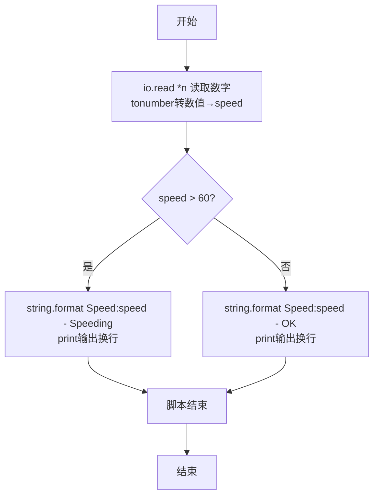
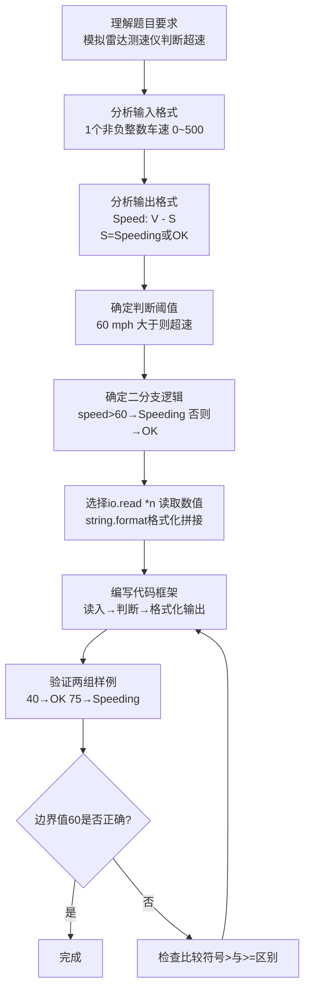

# 7-8 超速判断（Lua语言实现）

## 前言

本题（7-8 超速判断）的主要考点是：准确理解题意、规范处理输入输出格式，并正确处理边界与精度。下面先给出题目描述与格式要求，再通过清晰的思路与可直接运行的lua代码进行讲解。

## 题目描述

模拟交通警察的雷达测速仪。输入汽车速度，如果速度超出60 mph，则显示“Speeding”，否则显示“OK”。

## 输入格式

输入在一行中给出1个不超过500的非负整数，即雷达测到的车速。

## 输出格式

在一行中输出测速仪显示结果，格式为：Speed: V - S，其中V是车速，S或者是Speeding、或者是OK。

## 输入样例1

```in
40
```

## 输入样例2

```in
75
```

## 输出样例1

```out
Speed: 40 - OK
```

## 输出样例2

```out
Speed: 75 - Speeding
```

## 解题思路

### 1. 核心问题分析

本题是典型的单条件二分支判断问题，核心在于读取车速后与阈值60 mph进行比较，根据比较结果输出不同的提示信息，同时需要严格按照指定格式拼接输出字符串。

### 2. 算法原理说明

1. 使用`io.read("*n")`从标准输入读取一个数字车速值。
2. 利用`if-else`条件分支结构进行判断：
   - 若 `speed > 60`，判定为超速，输出"Speeding"
   - 否则（`speed <= 60`），判定为正常，输出"OK"
3. 使用`string.format`按照`Speed: V - S`的固定格式拼接车速值和判断结果，通过`print()`输出。

### 3. 具体计算步骤

1. 定义局部变量`speed`存储车速，通过`io.read("*n")`直接读入数值。
2. 判断`speed`是否大于60。
3. 按指定格式输出测速结果。

## 完整代码

```lua
-- 7-8 超速判断
local speed = tonumber(io.read("*n"))
if speed > 60 then
    print(string.format("Speed: %d - Speeding", speed))
else
    print(string.format("Speed: %d - OK", speed))
end
```

## 代码流程说明

1. **读取数字输入**：`io.read("*n")`从标准输入读取下一个数字，`tonumber()`确保转换为数值类型，赋值给局部变量`speed`。
2. **条件判断与格式化输出**：
   - `speed > 60`为真（超速）：`string.format`按格式拼接`Speed: V - Speeding`，由`print()`输出并自动换行
   - 否则（未超速）：`string.format`按格式拼接`Speed: V - OK`，由`print()`输出并自动换行
3. **脚本结束**：Lua脚本执行完毕，无显式返回。

## 代码流程图



## 解题流程图



## 代码解析

```lua
-- 7-8 超速判断
local speed = tonumber(io.read("*n"))
if speed > 60 then
    print(string.format("Speed: %d - Speeding", speed))
else
    print(string.format("Speed: %d - OK", speed))
end
```

读取数字输入

## 复杂度分析

设输入规模为 $n$（对数值类题目为参与运算的数据量，对字符串/序列类题目为长度）。

- **时间复杂度**：$O(n)$ 或 $O(n \log n)$，主要来自一次线性遍历与常数次数学运算，无嵌套高复杂度循环。
- **空间复杂度**：$O(n)$，用于存储输入、中间结果与输出字符串；若仅使用若干标量变量则为 $O(1)$。

## 常见易错点

### 1. 输入/输出格式不符
错误：多余空格、遗漏换行、大小写或精度不符。后果：判题系统判为格式错误。正确：严格按题目要求的格式输出，数值用合适精度。

### 2. 边界条件遗漏
错误：未处理 0、最小值、单字符或空输入等边界。后果：特例 WA。正确：先列出所有边界样例，在编码前单独分支处理。

### 3. 整数溢出与类型
错误：使用过小的整数类型或忽略负号。后果：大数计算溢出。正确：按数据范围选择合适类型，必要时用更大整数类型或字符串处理。

## 更多测试

### 测试一：常规边界

**输入：**

```text
（可取题目边界附近的值，如最小值或最大值）
```

**输出：**

```text
（依据题意推导的正确结果）
```

### 测试二：特殊用例

**输入：**

```text
（可取易错点，如 0、单一元素、全同值等）
```

**输出：**

```text
（对应正确结果）
```

## 总结

本题的核心在于理清「超速判断」的输入输出关系与边界处理：先按格式读取输入，再依据规则逐步计算或遍历，最后按规范输出。该思路可迁移到同类格式化输入输出与模拟计算的题目。

