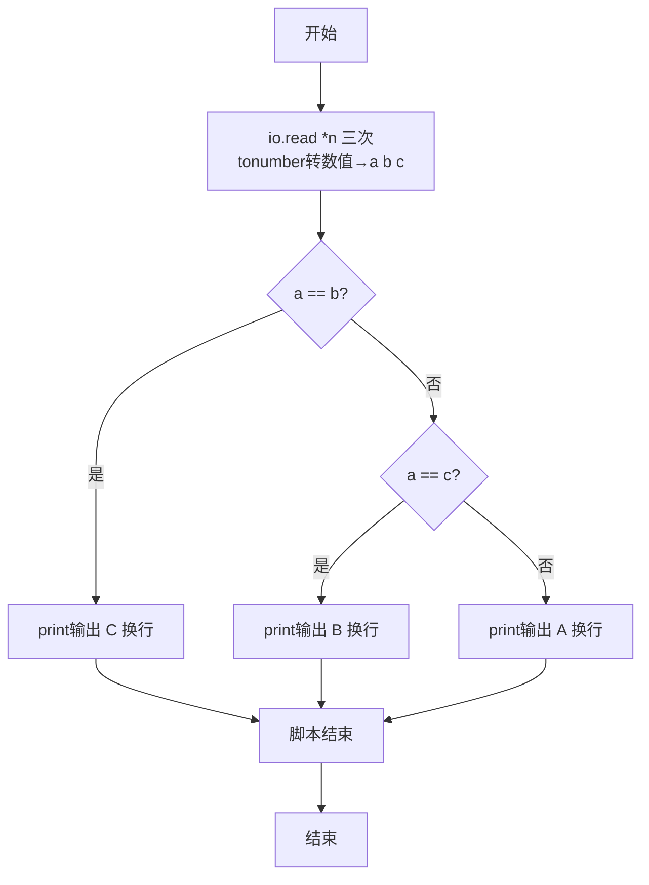
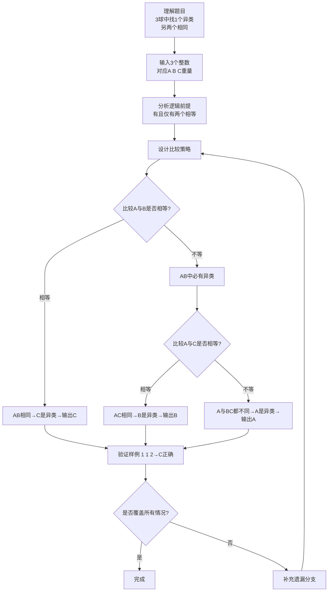

# 7-9 用天平找小球（Lua语言实现）

## 前言

本题（7-9 用天平找小球）的主要考点是：准确理解题意、规范处理输入输出格式，并正确处理边界与精度。下面先给出题目描述与格式要求，再通过清晰的思路与可直接运行的lua代码进行讲解。

## 题目描述

三个球A、B、C，大小形状相同且其中有一个球与其他球重量不同。要求找出这个不一样的球。

## 输入格式

输入在一行中给出3个正整数，顺序对应球A、B、C的重量。

## 输出格式

在一行中输出唯一的那个不一样的球。

## 输入样例

```in
1 1 2
```

## 输出样例

```out
C
```

## 解题思路

### 1. 核心问题分析

题目给定三个球（A、B、C），已知恰好有一个球重量与另外两个不同（另外两个重量相同）。核心在于利用"只有一个异类，另外两个相同"这一前提，通过最多两次两两相等比较即可确定异类球的编号。

### 2. 算法原理说明

由于三个球中必有且仅有两个重量相等，我们只需依次进行相等性判断：
1. 若A与B重量相等（a == b），说明A和B都是正常的，异类必然是C。
2. 若A与B不相等，则A和B中必有一个是异类，此时再比较A和C：
   - 若A与C相等（a == c），说明A和C正常，异类是B；
   - 若A与C也不相等，说明A与B、C都不同，异类就是A本身。
（逻辑上无需再比较B和C，因为以上分支已覆盖所有三种可能）

### 3. 具体计算步骤

1. 分别调用`io.read("*n")`三次，读取三个整数a、b、c，对应A、B、C三球重量。
2. 判断a == b？→ 相等则输出C。
3. 否则判断a == c？→ 相等则输出B，否则输出A。

## 完整代码

```lua
-- 7-9 用天平找小球
local a = tonumber(io.read("*n"))
local b = tonumber(io.read("*n"))
local c = tonumber(io.read("*n"))

if a == b then
    print("C")
elseif a == c then
    print("B")
else
    print("A")
end
```

## 代码流程说明

1. **声明局部变量并读取输入**：依次通过三次`io.read("*n")`配合`tonumber()`，读取三个数字并转为数值，分别存入局部变量`a`、`b`、`c`，对应球A、B、C的重量。
2. **逻辑判断（最多两次比较）：
   - 第一层：若`a == b`为真 → A与B同重 → C是异类 → `print("C")`输出字母C并换行
   - 否则进入第二层：若`a == c`为真 → A与C同重 → B是异类 → `print("B")`输出字母B并换行
   - 否则（A既不等于B也不等于C）→ A是异类 → `print("A")`输出字母A并换行
3. **脚本结束**：Lua脚本执行完毕。

## 代码流程图



## 解题流程图



## 代码解析

```lua
-- 7-9 用天平找小球
local a = tonumber(io.read("*n"))
local b = tonumber(io.read("*n"))
local c = tonumber(io.read("*n"))

if a == b then
    print("C")
elseif a == c then
    print("B")
else
    print("A")
end
```

声明局部变量并读取输入

## 复杂度分析

程序只进行两次比较，时间复杂度为 O(1)，额外空间复杂度为 O(1).

## 常见易错点

- 题目前提是恰好两个球等重，判断时要覆盖异类球位于 A、B、C 三种位置。
- 不能把“不等于”直接等同于 A 是异类，必须结合第二次比较判断。

## 更多测试

边界测试：输入 5 5 8，预期输出 C。

特殊测试：输入 8 5 5，预期输出 A，验证异类球位于第一个位置。

## 总结

本题的核心在于理清「用天平找小球」的输入输出关系与边界处理：先按格式读取输入，再依据规则逐步计算或遍历，最后按规范输出。该思路可迁移到同类格式化输入输出与模拟计算的题目。
